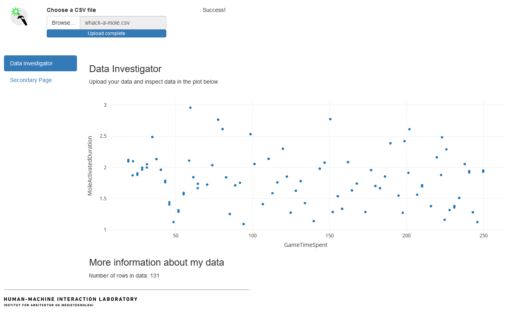

# R Shiny Application Demo (Modular Design)
This demo intends to illustrate how to build a modular mostly-vanilla R Shiny application after some principles:
 * Modularity: Each part is a module with a clear conceptual purpose.
 * Variables are isolated to their modules, as much as possible.
 * Data is always reactive and processed in reactive contexts.
 * Data processing should happen in context of where the data is used.

This demo showcases 4 types of modules:
 * Modules delivering data ([data_import_module.R](https://github.com/med-material/rshiny_application_demo/blob/main/modules/data_import_module.R))
 * Modules which represent webpages or tabs in a UI ([page_data_investigator_module.R](https://github.com/med-material/rshiny_application_demo/blob/main/modules/page_data_investigator_module.R))
 * Modules which plot data from another module ([plot_timeline_module.R](https://github.com/med-material/rshiny_application_demo/blob/main/modules/plot_timeline_module.R))
 * Modules within modules example ([page_data_investigator_module.R](https://github.com/med-material/rshiny_application_demo/blob/main/modules/page_data_investigator_module.R) + [plot_timeline_module.R](https://github.com/med-material/rshiny_application_demo/blob/main/modules/plot_timeline_module.R))
  * Modules modifying data: ([data_add_synthetic_module.R](https://github.com/med-material/rshiny_application_demo/blob/main/modules/data_add_synthetic_module.R)
 * Auto-Generated modules: (TODO)

## Why?
R code is often functional programming, and can quickly lead to long endless scripts which are difficult to debug. What may start as a simple one-line plot, can quickly escalate. To make life easier, splitting up the code into modules helps us limit the variables in play and focus on writing readable code. Modules also come with the advantage, that you can create as many instances of them as you like, which means we can re-use code as we please.

## Conceptual Overview

The illustration above shows how the modules have conceptually been conceived. Compare the left-most figure to the screenshot. Here you can see how each module represent a specific area on the webpage. The modules depend on communication between each other, rather than on global variables, a bit similar to Object Oriented Programming. The right-most figure is a more conceptual UML-like representation of the modules. The core application consists of 3 files (ui.R, global.R, server.R) and defines the application skeleton only. The modules take care of actual content. This allow for upscaling the application.

## Thanks and Further Reading

This demo application was inspired by the ideas in the [AR Data Modularization Article](https://www.ardata.fr/en/post/2019/04/26/share-reactive-among-shiny-modules/). We recommend anyone interested in using this demo application to read further there.
